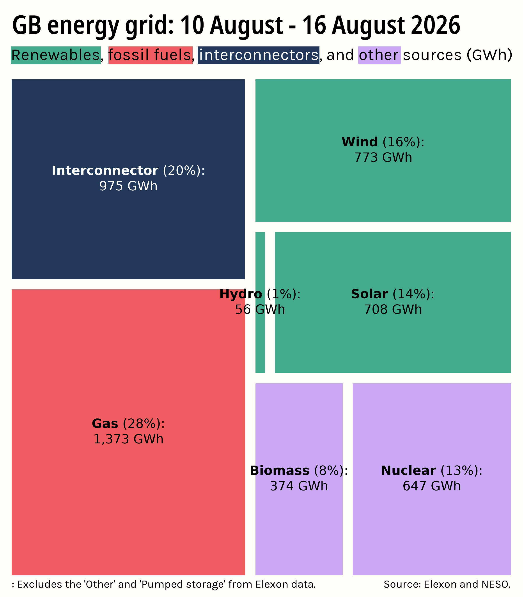

<div align="center">
    
    <br>
    <h3 align="center">⚡National Grid weekly</h3>
    <p>Create a weekly summary of energy passsing <br> through Great Britain's grid</p>
</div>

<!-- TABLE OF CONTENTS -->
<details>
  <summary>Table of Contents</summary>
  <ol>
    <li>
      <a href="#about-this-project">About this project</a>
    </li>
    <li>
      <a href="#built-with">Built with</a>
    </li>
    <li>
      <a href="#getting-started">Getting Started</a>
      <ul>
        <li><a href="#prerequisites">Prerequisites</a></li>
      </ul>
    </li>
    <li><a href="#usage">Usage</a></li>
    <ul>
        <li><a href="#automation">Automation</a></li>
        <li><a href="#timescale">Timescale</a></li>
        <li><a href="#default-start-date">Default start date</a></li>
    </ul>
    <li><a href="#roadmap">Roadmap</a></li>
    <li><a href="#data-sources">Data sources</a></li>
    <li><a href="#acknowledgements">Acknowledgments</a></li>
  </ol>
</details>

## About this project
<p align="center">
    
</p>

Where does Great Britain get its energy? 

Behind the electricity we consume in our homes and businesses sits a vast network of generators and interconnectors. This project aims to demistify where our energy is coming from in a simple, stylish treemap visualization.

While many brilliant projects that summarise the GB grid's energy network already exist, this script creates elegant visualizations explicitly designed for social media - the idea being we should share data with people in the places they already spend their time.

### Built with
* 
* 
* 
* 

## Getting started
### Prerequisites
The `requirements.txt` file lists all the Python libraries necessary for you to run this script. To install them all run:

```
pip install -r requirements.txt
```

## Usage
Treemaps are generated by the `fetch_data.py` script in the 'scripts' folder. 

Final images are saved to their own 'images' folder that sits in the parent folder above your Python script.

```
grid-project/
├── images/
│   └── Example_2026-08-10_2026-08-16.png <--- This is where treemaps are saved as PNGs
├── scripts
│   └── fetch_data.py <--- Running this script will create a treemap
├── project_images/
│   └── Project_logo.jpg
├── requirements.txt
└── README.md
```

### Automation
This script is designed to be run on an automated basis either using either cron jobs (Mac/Linux) or Task Scheduler (Windows).

Running it on any given day will generate a treemap using data for Monday to Sunday from the _previous week_. For example, if the script is run on a Monday of week 2, the treemap will visualize Monday to Sunday of week 1. This is done to ensure the output always contains a complete calendar week which makes preserves the accuracy of week-to-week comparison.

### Time scale
In this case, a week is defined as spanning from 00:00 (midnight) on a Monday through to 23:30 on a Sunday. One day will be 1hr shorter/longer in weeks containing clocks moving forwards or backwards.

### Deault start date
By default, the script takes your systsem's current date as the start point for the script using Python's `datetime.now()`. 

If you want to use older datasets, you could simply replace the current date with a value of your choosing. Keep in mind the script will currently generate a treemap for the Mon-Sun week _before_ your given start date.

```Python
# identify previous monday to sunday period
now_uk = dt.now(LONDON)
most_recent_monday = now_uk.date() - timedelta(days=now_uk.weekday())
week_start = most_recent_monday - timedelta(days=7)
week_end = most_recent_monday - timedelta(days=1)
```

## Roadmap
- [ ] Add automated posting to Instagram w/ instagrapi
- [ ] Improve labelling for smaller treemap slices
- [ ] Allow custom date ranges for plot data

## Data sources
**Elexon - Generation by fuel type** 
<br>
The Elexon generation by fuel type API reports electricity generation across Great Britain. Values are returned as average megawatts over a 30 minute period known as a 'Settlement period'. 

There are 48 settlement periods in a 24 hour period, with the exception of days when clocks change.

[Link](https://bmrs.elexon.co.uk/generation-by-fuel-type)

**NESO - Demand update**
<br>
Most of Great Britain's solar power is embedded, meaning it is not connected directly to the National Grid's long range transmission networks. 

This excludes solar from the Elexon outrun data used above, so we use NESO's demand CSV to include solar in our final visualization.

[Link](https://bmrs.elexon.co.uk/generation-by-fuel-type)

## Acknowledgements
Thank you to Kate Morley who's fantastic [National Grid: Live](https://grid.iamkate.com/) was both the inspiration for this project and an invaluable resource for getting it to work properly.
